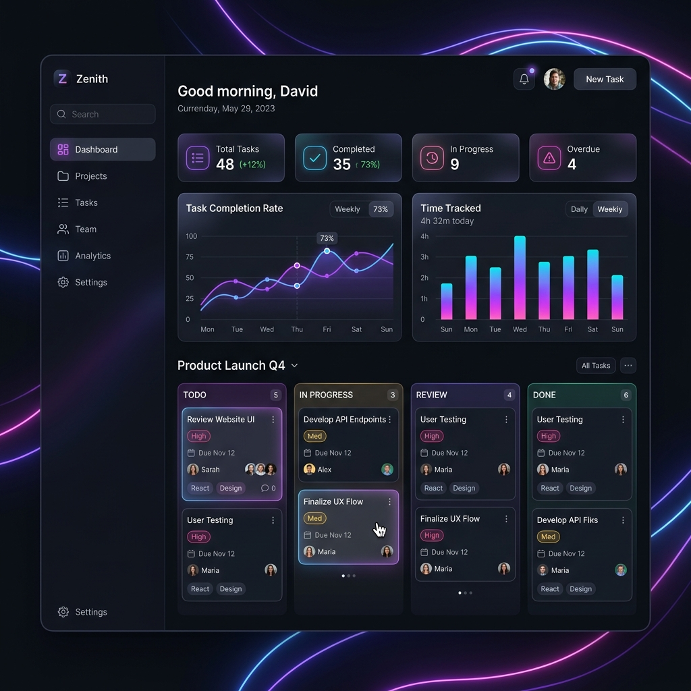

# Premium Task Tracker

A beautiful, high-fidelity task management application utilizing a Node.js + Express backend, local persistent SQLite storage, and a premium glassmorphic Single Page Application (SPA) frontend.



## Core Features
- 📊 **Dynamic Dashboard**: Animated visual statistics, overdue alerts, and completion rates.
- 📋 **Kanban Board**: Drag-and-drop workflow status columns.
- 🔍 **Task Search & Filters**: Multi-faceted filter bar (status, priority, category, assignee) and live search.
- 📅 **Interactive Calendar**: Full month layout displaying deadlines.
- ⏱️ **Pomodoro / Time Tracker**: Run focus timers on tasks and directly log spent time.
- 💬 **Collaborative Context**: Task details modal with comment feeds and historical activity logs.
- ⚙️ **Data Configuration**: Import & export system data as JSON.

---

## Folder Structure
```
task-tracker/
├── package.json               # Dependencies and scripts
├── server.js                  # Backend REST API entry point
├── database.js                # Database creation, tables, and seeding logic
├── public/                    # Frontend client code
│   ├── index.html             # Single Page HTML layout
│   ├── css/
│   │   └── style.css          # Glassmorphism styling & variable layout
│   ├── js/
│   │   ├── api.js             # API wrapper (using fetch)
│   │   ├── utils.js           # Time and canvas utilities
│   │   ├── components.js      # Individual UI components
│   │   └── app.js             # Core App state and navigation manager
│   └── assets/                # Design assets and screenshots
├── docs/                      # Comprehensive technical docs
│   ├── srs.md                 # System requirements
│   ├── architecture.md        # Architecture diagram & flow
│   ├── database_schema.md     # SQLite schemas & data structures
│   ├── api_documentation.md   # API controller endpoints specs
│   └── roadmap.md             # Development plan
└── dashboard.json             # Live implementation progress metrics
```

---

## Technical Specifications
- **Backend**: Node.js, Express.js, Morgan (logging), CORS.
- **Database**: SQLite3.
- **Frontend**: Vanilla HTML5, CSS3 (variables, grid, flexbox, backdrop filters), ES6 JavaScript.
- **Libraries**: Chart.js (via CDN) for animations, custom SVGs for iconography.

---

## Getting Started

### 1. Prerequisites
Ensure you have [Node.js](https://nodejs.org/) installed.

### 2. Setup
Clone or navigate to the workspace directory and install dependencies:
```bash
npm install
```

### 3. Execution
To run the server in development mode:
```bash
npm start
```
The application will launch and be accessible at [http://localhost:3000](http://localhost:3000).

---

## Current Status: Implementing Backend APIs (Module 2)
- **Overall Completion**: `17%`
- **Active Module**: `Module 2: RESTful Web API Endpoints` (Module 1 Completed)
